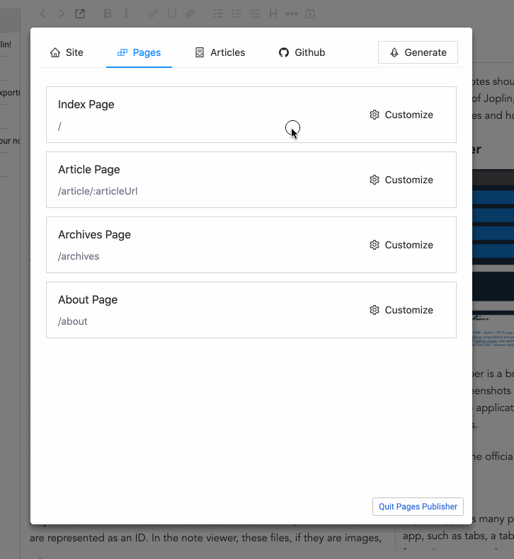

# Joplin Pages Publisher

This plugin helps you generate a static website from your picked Joplin notes, and publish it as [Github Pages](https://pages.github.com/) which are accessible on Web, **with a few mouse clicks, even if you know nothing about website building & publishing / Git / Github**.

Also, this plugin allows you to customize your website's theme, if you know something about HTML / CSS / JavaScript.

Hope you enjoy it!

# User Guide

Please read a short and simple [User Guide in wiki](https://github.com/ylc395/joplin-plugin-pages-publisher/wiki/User-Guide) before starting using it.

# Usage Preview

Just as simple as the gif above!

Published blog url: https://chenyulu.github.io/

# Contribution

Issues / Pull Requests / Discussion are welcome!
